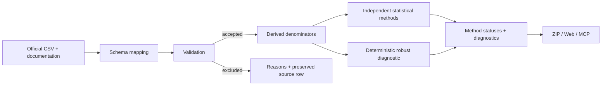
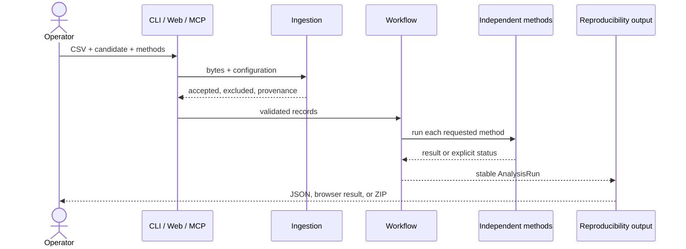

# Precinct Election Analysis — Rust

A standalone Rust implementation for validating precinct-level election CSV data, running transparent exploratory diagnostics, producing reproducibility bundles, serving a small web application, and exposing the same workflow to LLM clients through a native MCP server.

> An anomaly is unusual under a stated exploratory model. It is not proof of fraud, manipulation, misconduct, or an incorrect outcome. A risk-limiting audit examines ballot evidence; aggregate precinct diagnostics do not confirm an election outcome.

No software license has been selected. All rights remain with the repository owner unless and until a license is added.

## Quick start

Requirements: Rust 1.89 or newer.

```powershell
cargo build --release
cargo run -- sample --rows 120 --output sample.csv
cargo run -- validate sample.csv
cargo run -- analyze sample.csv --candidate candidate_a --output analysis.zip
cargo run -- serve
```

Open `http://127.0.0.1:8080`, choose the generated sample, and select **Validate and analyze**. Pass `--config config.yaml` before the subcommand to load the checked-in configuration, for example `cargo run -- --config config.yaml analyze sample.csv`.

## Operator workflow

1. Obtain a precinct-level CSV from an authoritative source and retain its documentation.
2. Copy `config.yaml` and map identifiers, contest totals, candidates, turnout inputs, coordinates, and optional down-ballot contests.
3. Run `validate`. Review every warning and every excluded row before interpreting results.
4. Run `analyze` with a candidate key from the configuration.
5. Open the ZIP bundle. It contains preserved validated input, scoped results, excluded records, validation findings, complete run metadata, and a factual Markdown report.
6. Treat flags as review leads under named models. Reconcile them with source documentation and ordinary election context.
7. Use ballot-level audit procedures—not this software—when evidence about the reported outcome is required.



## How the system works

1. The loader enforces the byte limit, parses the CSV directly from memory, and rejects duplicate headers.
2. The configured schema wins when its required fields are present. Otherwise, an explicit Harris/Trump legacy adapter may be selected.
3. Every source field is retained verbatim in a per-row source map. SHA-256, source name, schema choice, and source columns are recorded.
4. Counts must be nonnegative integers. The validator checks identifiers, duplicates, candidate/contest/ballot/registration relationships, coordinates, and turnout.
5. Invalid rows move to an excluded collection with machine-readable reasons. Missing official counts and coordinates are never invented.
6. Candidate share uses valid contest votes. Calculated turnout uses ballots cast divided by registered voters; mapped reported turnout remains separate.
7. Each requested method runs independently and receives a successful, unavailable, skipped, or failed status.
8. The ZIP exporter and the web/MCP surfaces use the same `AnalysisRun`, preventing scope or result drift.



## Analysis methods

- `turnout_share`: leave-one-out linear regression trained on the configured lower-turnout baseline quantile, with studentized residual flags.
- `vote_share_by_count`: descriptive OLS trend of candidate share against candidate vote count. It creates no anomaly flag.
- `down_ballot_difference`: ETA-compatible presidential versus configured same-party down-ballot difference. It is descriptive.
- `digit_diagnostics`: dataset-level last-digit chi-square tests with Holm family-wise-error correction. Results are not copied onto precincts as scores.
- `spatial`: reproducible K-nearest-neighbor Moran diagnostics with permutation p-values and Benjamini–Hochberg correction for local tests.
- `robust_multivariate`: deterministic median/MAD distance over an allow-list of numeric features. Its bounded score is a ranking aid, not a probability.

See [docs/methodology.md](docs/methodology.md) for assumptions and [docs/data-format.md](docs/data-format.md) for the schema.

## MCP server

```powershell
cargo run -- --config config.yaml mcp
```

Example client configuration:

```json
{
  "mcpServers": {
    "precinct-election-analysis-rs": {
      "command": "E:\\precinct-election-analysis-rs\\target\\release\\precinct-election-analysis-rs.exe",
      "args": ["--config", "E:\\precinct-election-analysis-rs\\config.yaml", "mcp"]
    }
  }
}
```

Tools: `health`, `sample_csv`, `validate_csv`, `analyze_csv`, and `narrative_context`. Payload previews are bounded. The narrative tool supplies computed facts and prohibited-claim constraints; it does not ask an LLM to perform new statistics.

## Quality gates

```powershell
cargo fmt --all -- --check
cargo clippy --all-targets --all-features -- -D warnings
cargo test --all-targets
cargo build --release
```

CI runs the same gates. See [docs/architecture.md](docs/architecture.md) and [docs/user-guide.md](docs/user-guide.md) for further detail.
