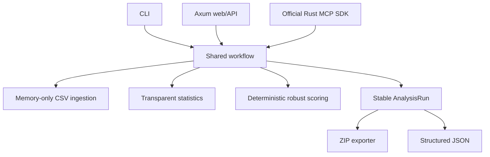

# Architecture

All operator surfaces call one ingestion function and one workflow function. This is the main consistency invariant.

## Modules

- `config`: typed defaults, partial YAML overrides, and validation.
- `ingestion`: size/header/schema/count/relationship validation and provenance.
- `statistics`: regression, digit, spatial, correction, and robust-scoring routines.
- `workflow`: method dispatch and independent status isolation.
- `export`: reproducibility ZIP and factual report.
- `web`: small local UI plus JSON endpoints.
- `mcp`: bounded stdio tools built on the official Rust SDK.
- `sample`: deterministic fictional data.

The server binds to loopback by default. MCP uses stdio and emits logs only to stderr so JSON-RPC stdout is not corrupted.
